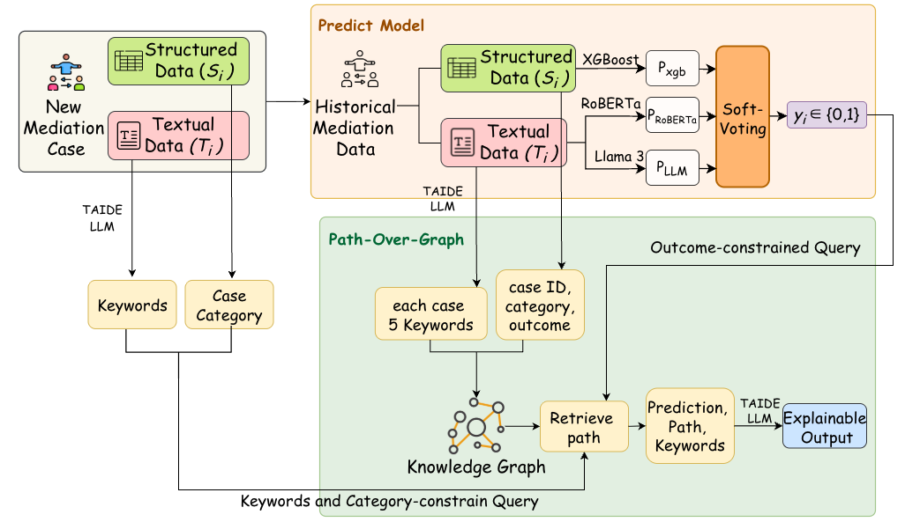
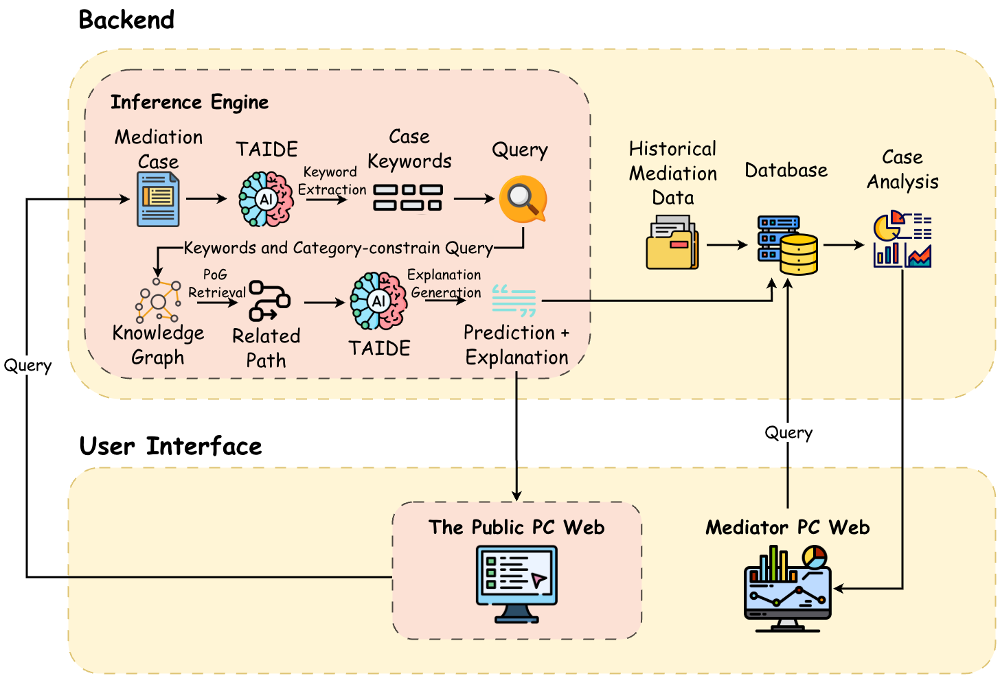

# PoG-Mediator

PoG-Mediator is an AI-assisted mediation outcome analysis system. It combines structured mediation metadata, case text, a three-path ensemble prediction model, and Path-over-Graph retrieval to predict whether a mediation case is likely to be successful and provide explainable knowledge-graph paths.

---

## What Makes PoG-Mediator Unique?

- Path-over-Graph explanation for mediation prediction
- Three-path ensemble inference using structured features, text classification, and TAIDE LoRA classification
- TAIDE-powered keyword extraction and explanation generation
- MySQL-backed case cache and searchable mediation history
- React dashboard for prediction, case search, and category-level statistics

PoG-Mediator is designed to make mediation prediction more interpretable by returning not only a binary result, but also keywords, related graph paths, and an explanation grounded in historical mediation data.

---

## System Pipeline



The system receives a new mediation case, separates structured fields and textual content, predicts the mediation outcome through an ensemble model, retrieves relevant knowledge-graph paths constrained by category and keywords, and generates an explainable output.

---

## Full Stack Overview



The backend handles model loading, prediction, graph retrieval, database caching, and dashboard APIs. The frontend provides a public prediction interface and a mediator-facing dashboard for historical case analysis.

---

## System Components

| Component          | Main File / Resource           | Purpose                                                                                  |
| ------------------ | ------------------------------ | ---------------------------------------------------------------------------------------- |
| Flask API          | `App.py`                     | Provides prediction, status, statistics, case search, and React static serving endpoints |
| Database           | MySQL + SQLAlchemy             | Stores case metadata, prediction results, keywords, explanations, and graph paths        |
| Data Import        | `import_csv.py`              | Imports `files/demo_data.csv` into the `case_records` table                          |
| Ensemble Inference | `dynamic_predict_llm.py`     | Loads models and combines XGBoost, RoBERTa, and TAIDE LoRA predictions                   |
| Path-over-Graph    | `ensemble_3path/demo_kg.gml` | Retrieves related paths from the mediation knowledge graph                               |
| Few-shot Keywords  | `files/few_shot.csv`         | Provides examples for TAIDE keyword extraction                                           |
| Frontend           | `frontend/src/App.js`        | React interface for AI prediction and data dashboard                                     |

### Model Stack

| Path       | Model / Resource                            | Role                                         |
| ---------- | ------------------------------------------- | -------------------------------------------- |
| Path 1     | XGBoost + OneHotEncoder                     | Predicts from structured case features       |
| Path 2     | `hfl/chinese-roberta-wwm-ext-large`       | Predicts from case text                      |
| Path 3     | `taide/Llama-3.1-TAIDE-LX-8B-Chat` + LoRA | Performs TAIDE-based case classification     |
| Generation | TAIDE GGUF model                            | Extracts keywords and generates explanations |
| Ensemble   | `ensemble_3path/meta.json`                | Stores weights and decision threshold        |

### Model Card Metadata

| Field | Value |
| --- | --- |
| Base model | `taide/Llama-3.1-TAIDE-LX-8B-Chat` |
| Adapter type | PEFT / LoRA |
| Library | `peft` |
| Tags | `lora`, `transformers`, `base_model:adapter:taide/Llama-3.1-TAIDE-LX-8B-Chat` |
| PEFT version | `0.19.1` |

This project uses a LoRA adapter fine-tuned from `taide/Llama-3.1-TAIDE-LX-8B-Chat` as part of the mediation prediction stack.

---

## Project Structure

```text
PoG-Mediator/
├── App.py                         # Flask backend and API routes
├── dynamic_predict_llm.py          # AI initialization, ensemble prediction, KG retrieval
├── import_csv.py                   # Import demo CSV data into MySQL
├── requirements.txt                # Python dependencies
├── README.md                       # Main project documentation
├── pog.png                         # Prediction and Path-over-Graph pipeline figure
├── pog_demo.png                    # Full stack architecture figure
├── files/
│   ├── demo_data.csv               # Demo historical mediation data
│   ├── demo_ten.csv                # Small demo subset
│   └── few_shot.csv                # Few-shot examples for keyword extraction
├── frontend/
│   ├── package.json                # React dependencies and scripts
│   ├── README.md                   # Create React App reference README
│   ├── public/
│   └── src/
│       ├── App.js                  # Main React application
│       ├── App.css
│       ├── index.js
│       └── index.css
└── ensemble_3path/                 # Required model artifacts, not included in this folder snapshot
    ├── taide-7b-a.2-q4_k_m.gguf
    ├── demo_kg.gml
    ├── roberta_model.pt
    ├── xgb_ohe.joblib
    ├── xgb_calibrated_model.joblib
    ├── meta.json
    └── taide_lora/
```

---

## Setup Instructions

### 1. Clone the Project

```bash
git clone <your-repository-url>
cd PoG-Mediator
```

### 2. Create Python Environment

```bash
python -m venv venv
source venv/bin/activate
pip install -r requirements.txt
```

### 3. Prepare MySQL

The backend defaults to the following database configuration:

```text
DB_USER=mediation_user
DB_PASS=securepassword
DB_HOST=localhost
DB_NAME=mediation_db
```

You can override these values with environment variables:

```bash
export DB_USER="mediation_user"
export DB_PASS="securepassword"
export DB_HOST="localhost"
export DB_NAME="mediation_db"
```

Create a MySQL database named `mediation_db` before running the backend. `App.py` will create the `case_records` table automatically through SQLAlchemy.

### 4. Prepare Model Artifacts

The `ensemble_3path/` folder is required to run this project, but it is not uploaded to GitHub because the model artifacts are too large.

Download `ensemble_3path/` from Google Drive:

[Download ensemble_3path from Google Drive](https://drive.google.com/drive/folders/1_JSiQccyIE4n-QUZ-8qY6jos-KtA1ucn?usp=drive_link)

After downloading, place the folder in the project root:

```text
PoG-Mediator/
└── ensemble_3path/
```

Place the required model and graph artifacts under `ensemble_3path/`:

```text
ensemble_3path/
├── taide-7b-a.2-q4_k_m.gguf
├── demo_kg.gml
├── roberta_model.pt
├── xgb_ohe.joblib
├── xgb_calibrated_model.joblib
├── meta.json
└── taide_lora/
```

If the TAIDE classifier needs access to Hugging Face, set:

```bash
export HF_TOKEN="your-hugging-face-token"
```

### 5. Import Demo Data

```bash
python import_csv.py
```

This loads `files/demo_data.csv` into the MySQL `case_records` table and resets existing demo records.

### 6. Install Frontend Dependencies

```bash
cd frontend
npm install
```

### 7. Run Frontend in Development Mode

From the `frontend/` directory:

```bash
npm start
```

Open [http://localhost:3000](http://localhost:3000) in the browser. During development, `frontend/package.json` proxies API calls to `http://localhost:5001`.

### 8. Build Frontend for Flask Serving

From the `frontend/` directory:

```bash
npm run build
```

The production build is generated at `frontend/build/`. `App.py` serves this folder as the static frontend.

### 9. Run Backend

From the project root:

```bash
python App.py
```

The backend exposes these main API routes:

| Route            | Method | Purpose                                                               |
| ---------------- | ------ | --------------------------------------------------------------------- |
| `/api/status`  | GET    | Check whether AI modules are loading or ready                         |
| `/api/predict` | POST   | Predict mediation outcome and return keywords, paths, and explanation |
| `/api/stats`   | GET    | Return dashboard summary statistics                                   |
| `/api/cases`   | GET    | Search and filter stored case records                                 |

---

## Frontend Scripts

Inside `frontend/`, the available Create React App scripts are:

| Command           | Description                                                    |
| ----------------- | -------------------------------------------------------------- |
| `npm start`     | Runs the React development server at `http://localhost:3000` |
| `npm test`      | Starts the interactive test runner                             |
| `npm run build` | Creates an optimized production build in `frontend/build/`   |
| `npm run eject` | Ejects Create React App configuration; this is irreversible    |

---

## Data Format

`files/demo_data.csv` contains English demo mediation records with fields such as:

| Column            | Meaning                                        |
| ----------------- | ---------------------------------------------- |
| `Main_Category` | Civil or Criminal                              |
| `Sub_Category`  | Case subtype, such as Traffic Accident or Debt |
| `Is_Successful` | Historical mediation result                    |
| `Rounds`        | Number of mediation rounds                     |
| `People`        | Number of participants                         |
| `Days`          | Mediation duration                             |
| `Content`       | Anonymized case description                    |
| `Keywords`      | Case keywords                                  |
| `KG_Paths`      | Related knowledge-graph paths                  |
| `Explanation`   | Historical or generated explanation            |

`files/few_shot.csv` stores Chinese examples used by TAIDE for keyword extraction.

---

## Notes

- `dynamic_predict_llm.py` expects model artifacts in `ensemble_3path/`. This folder is too large for GitHub and must be downloaded from [Google Drive](https://drive.google.com/drive/folders/1_JSiQccyIE4n-QUZ-8qY6jos-KtA1ucn?usp=drive_link) before running the project.
- If `ensemble_3path/` is missing, the API can still start, but AI prediction quality or availability will be limited.
- The frontend sends English category labels. The backend maps these labels to Chinese before model inference, then translates generated outputs back to English.
- The database cache avoids recomputing AI inference when the same case content already exists in MySQL.
- The current frontend was bootstrapped with Create React App and uses React, Recharts, and Lucide React.
